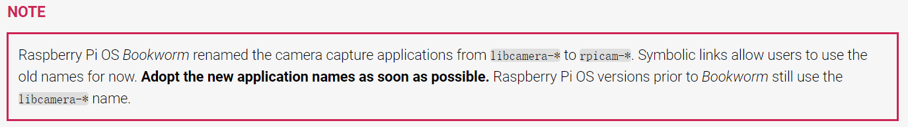

# raspberry pi

## 配置树莓派开机自启 websoket 服务

**连接蓝牙**

```sh
sudo apt update
sudo apt install -y bluetooth bluez blueman
sudo systemctl enable bluetooth
sudo systemctl start bluetooth
sudo bluetoothctl
power on
scan on
```

配对设备 `pair`
查看设备`devices`
查看特定设备的详细信息`info <DEVICE_MAC_ADDRESS>`

**完整步骤**

树莓派在虚拟环境运行 python

```sh
sudo apt update
sudo apt upgrade -y
sudo apt install -y python3-venv
python3 -m venv myenv  # 创建虚拟环境
source myenv/bin/activate  # 激活虚拟环境
pip install websockets pygame  # 安装所需的 Python 包
nano joystick_server.py  # 创建并编辑 Python 脚本文件
# 将你的代码粘贴到文件中，然后保存并退出
```

**添加服务器端代码**

```sh
mkdir project
nano /project/joystick_server.py
```

复制 `server.py` 代码

**编辑启动脚本**

```sh
nano ./home/ptsfdtz/project/start_joystick_server.sh
```

**启动脚本**

```sh
source /home/ptsfdtz/myenv/bin/activate
python /home/ptsfdtz/project/joystick_server.py
```

**1. 创建服务文件**

```sh
sudo nano /etc/systemd/system/joystick_server.service
```

**2. 编辑服务文件内容**

```sh
[Unit]
Description=Joystick Server
After=network.target

[Service]
User=ptsfdtz
Group=ptsfdtz
WorkingDirectory=/home/ptsfdtz/project
ExecStart=/bin/bash /home/ptsfdtz/project/start_joystick_server.sh
Restart=always

[Install]
WantedBy=multi-user.target
```

保存并关闭文件：在 nano 中按 Ctrl+X，然后按 Y 确认保存并按 Enter 退出。

**3. 确保 start_joystick_server.sh 可执行：**

```sh
chmod +x /home/ptsfdtz/project/start_joystick_server.sh
```

**4. 设置文件权限：**

```sh
sudo chmod 644 /etc/systemd/system/joystick_server.service
```

**5. 重新加载 systemd 管理器配置：**

```sh
sudo systemctl daemon-reload
```

**6. 启动服务：**

```sh
sudo systemctl start joystick_server.service
```

**7. 启用服务以便开机自启动：**

```sh
sudo systemctl enable joystick_server.service
```

**检查服务状态**：

```sh
sudo systemctl status joystick_server.service
```

配置树莓派摄像头使用`opencv`

通过 python 使用 opencv 库调用摄像头的时读取到空图像



测试摄像头是否能被读取

```sh
libcamera-jpeg -o test.jpg
```

```sh
vcgencmd get_camera
```

如果返回值是`supported=0 detected=0`则代表无法读取到硬件摄像头

解决方案：安装 `Raspicam` 摄像头库

```sh
cd ~
sudo apt install cmake gcc-aarch64-linux-gnu g++-aarch64-linux-gnu
git clone https://github.com/raspberrypi/userland
cd userland
./buildme --aarch64
sudo cp build/bin/* /bin/
```

修改 config.txt 文件

```sh
sudo nano /boot/config.txt
```

注释

```sh
#camera_auto_detect=1
#dtoverlay=vc4-kms-v3d
```

添加

```sh
dtoverlay=vc4-fkms-v3d
start_x=1
```
